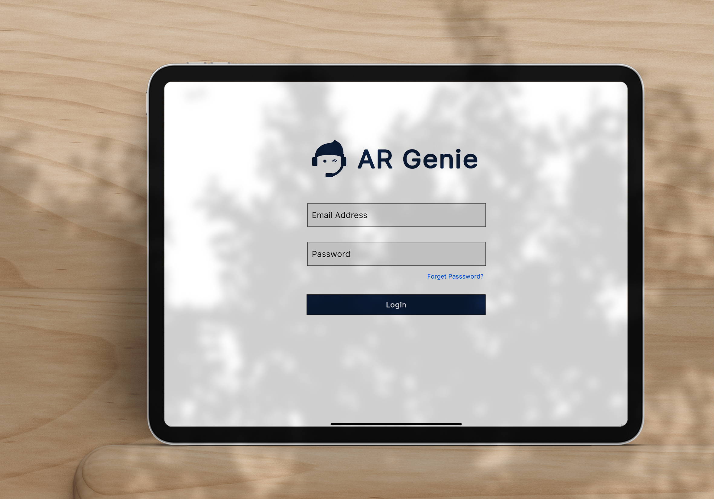
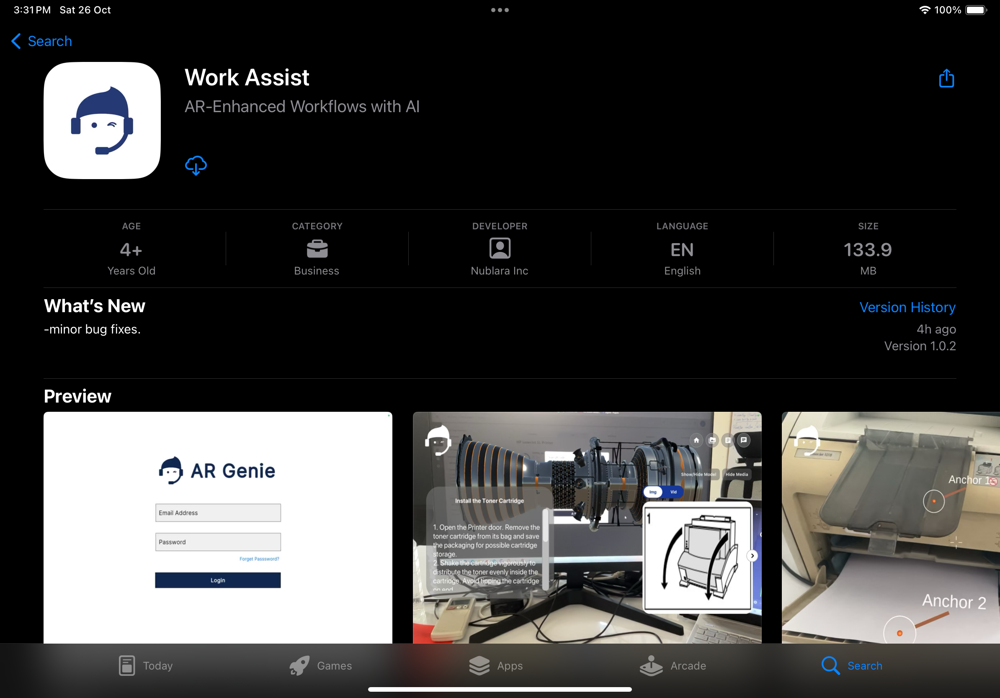

# 👩‍💻 Login

<figure><figcaption></figcaption></figure>

## Work Assist on iPad:&#x20;

### How to Login on iPad?

After submitting your required details on the " [Contact Us](https://www.argenie.ai/company/contact-us) " page of the website and getting verified, you can easily access AR Genie Work Assist on iPad using your login credentials.

&#x20;

* Download and install the **AR Genie Work Assist App** from your device's app store.\

<figure><figcaption>
<strong>AR Genie Work Assist App</strong>
</figcaption></figure>

* Launch the app and log in with your provided credentials.

<figure><figcaption>
Work Assist on iPad
</figcaption></figure>

Complete the login process and now you can easily use AR Genie Work Assist on iPad.&#x20;

### ENDS

\
