# 📼 Run Jobs

<figure>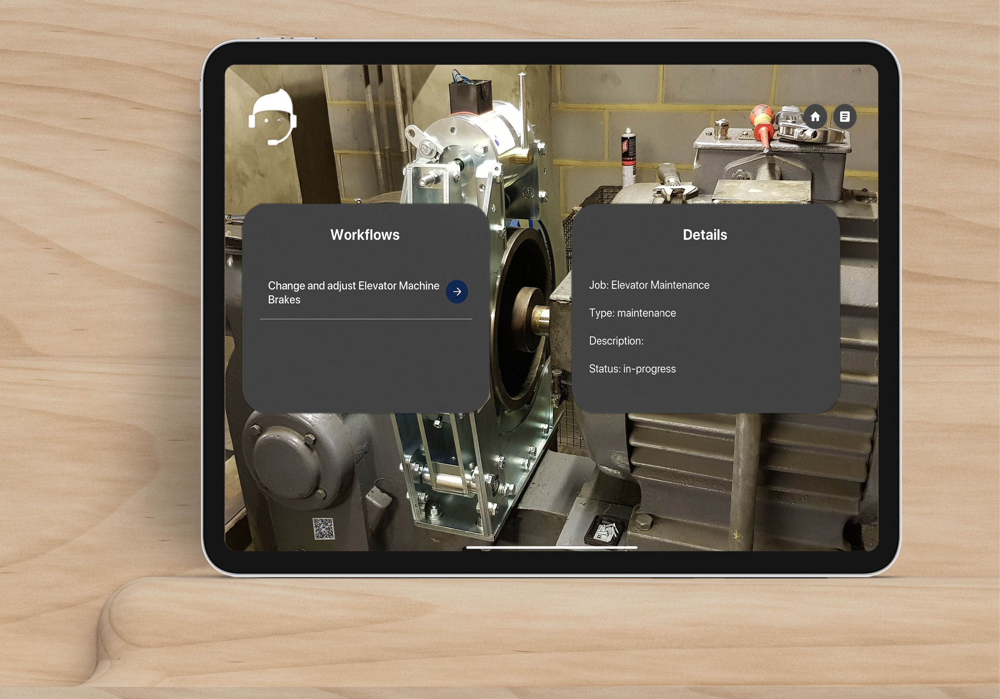<figcaption></figcaption></figure>

## Run Jobs on iPad:&#x20;

### How to Run Jobs on iPad?

* On **" My Job"** Dashboard, **Go to the** **" Start"** Button to run your specific job.

<figure><figcaption>
Go to the start button 
</figcaption></figure>

You will see the job details such as : Workflow & job name, job type, status & description of the job. \

<figure><figcaption>
Workflow Detail 
</figcaption></figure>

* Now Go to >> the **"Workflows"** and **"scan the QR Code"** on the object ( Asset ).&#x20;

<figure><figcaption>
Go to the workflow 
</figcaption></figure>

<figure><figcaption>
Scanning QR Code to view Workflow Steps 
</figcaption></figure>

Once scanned, you will see the workflow steps for your job.&#x20;

<figure><figcaption>
Workflopw Steps for a job 
</figcaption></figure>

* To view attached media for each step, Go to >>  **"Show Media"**. Use the side arrows to navigate through additional files associated with that particular workflow step media.&#x20;

<figure><figcaption>
Go to >> Show Media 
</figcaption></figure>

<figure><figcaption></figcaption></figure>

You can hide the media if not needed.

* You can navigate through all the media's through these icons highlighted with yellow box on the figure below.&#x20;

<figure>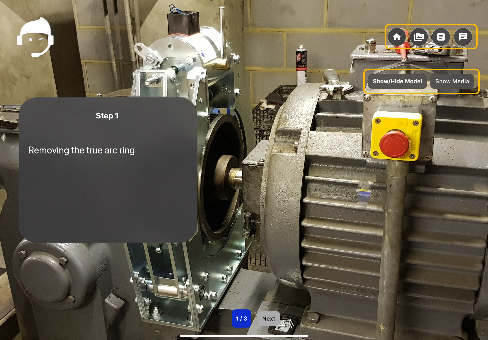<figcaption>
Social Media Icons
</figcaption></figure>

* To view the 3D Model. Enable **" Show Model"**. This will show you the attached model for that particular workflow step.

<figure>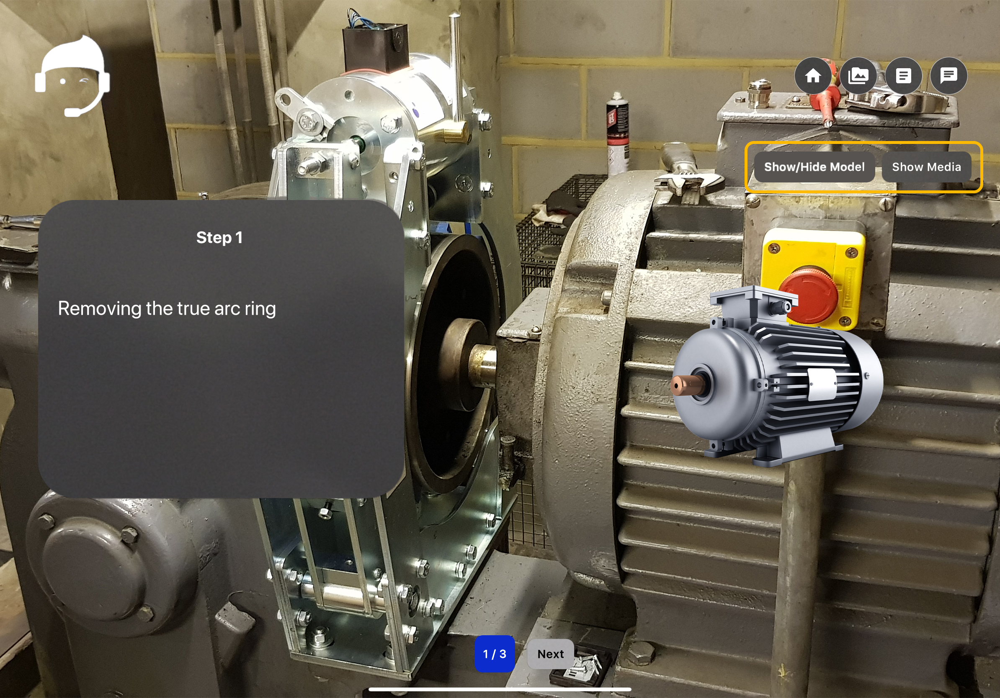<figcaption>
3D Model
</figcaption></figure>

* To view the Video file, Enable the Video Tab. This will show the video file associated with that particular workflow step.

\

<figure><figcaption>
Enable Video Tab to view the video file 
</figcaption></figure>

<figure><figcaption>
Video associated with the workflow step 
</figcaption></figure>

* Complete the step and Go to >> **"Next"** to view the subsequent step.&#x20;

<figure><figcaption>
Go to >> Next
</figcaption></figure>

* After completing a step, you'll be prompted to add evidence before proceeding. You must add this evidence to move on to the next step; otherwise, you'll be returned to your job dashboard.\

<figure><figcaption>
Add Evidence 
</figcaption></figure>

* Go to>>  the **"Yes"** button to add evidence. After pressing "Yes," you will see the **"Add Evidence**" section. Here, you can view options for adding evidence in different ways such as : Image Evidence,  Text Evidence and Video Evidence.&#x20;

<figure><figcaption>
Add Evidence 
</figcaption></figure>

**To add different types of evidence:**

Navigate to the left sidebar and select from the following options:

<figure><figcaption>
Select from the options to add the evidence 
</figcaption></figure>

* Click the **"Add Notes" icon** to include text evidence.
* Click the **"Camera" icon** to include image evidence &
* Click the **"Video" icon** to add video evidence.

After selecting an option, Go to >>  **"Add"** button.\

<figure>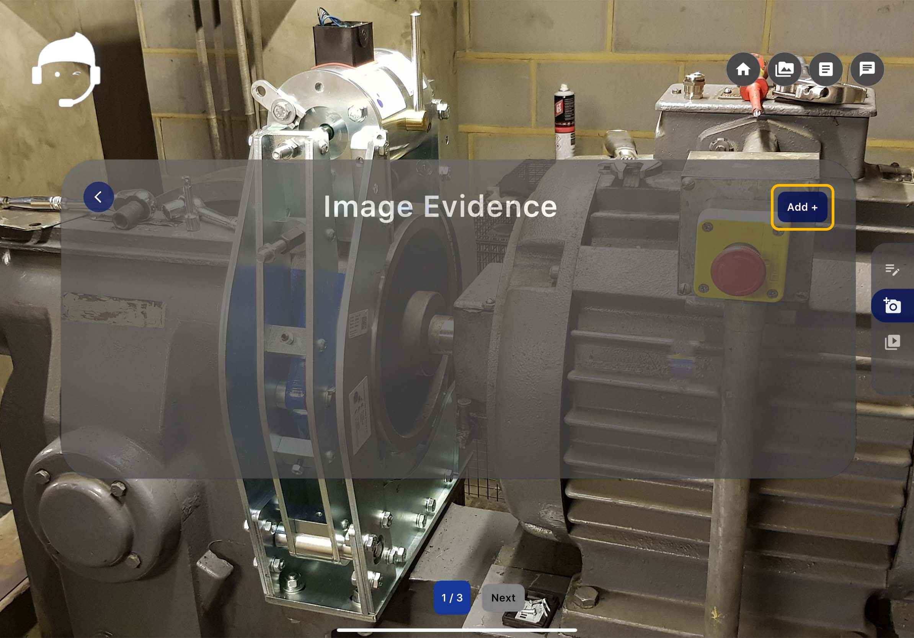<figcaption>
Go to >> Add Button 
</figcaption></figure>

**To add Image Evidence:**&#x20;

1. Go to >> the **"Camera icon"** & Go to >> the **"Add"** button.
2. Capture the image & Go to >> **"Add"** button.

<figure>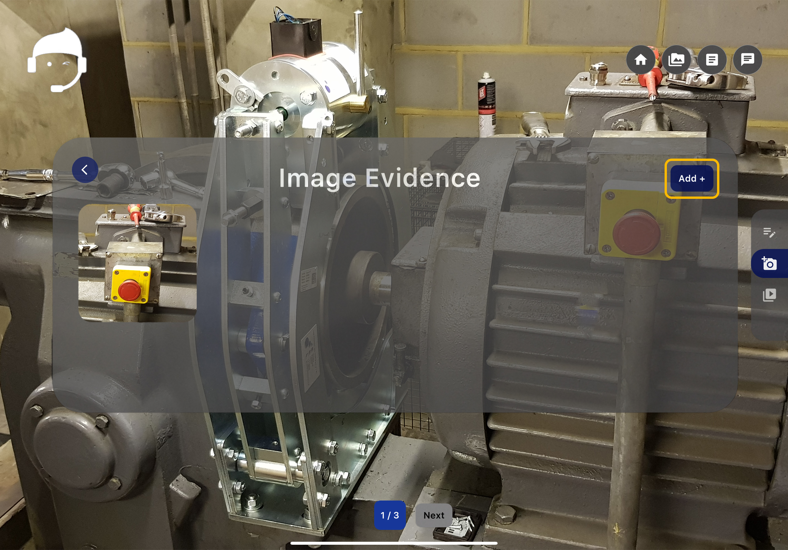<figcaption>
Capture the image and add 
</figcaption></figure>

<figure><figcaption>
Evidence uploading 
</figcaption></figure>

<figure><figcaption>
Evidence uploaded successfully 
</figcaption></figure>

3. Repeat these steps to add more images and Your Image Evidence is now saved.&#x20;

**To add Text Evidence:**&#x20;

1. Go to >> the **"Add Notes icon"** & then go to **"Add"** button.\

<figure><figcaption>
Go to Add Notes icon to add the text 
</figcaption></figure>

2. Add the note or text and **click on "done"**.&#x20;

<figure><figcaption>
Add the text 
</figcaption></figure>

<figure>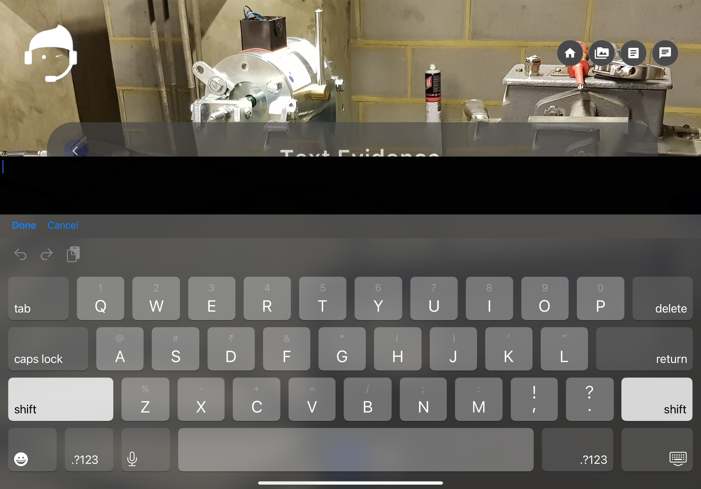<figcaption>
Add the text 
</figcaption></figure>

Your Text Evidence is now saved.&#x20;

**To add Video Evidence:** \

1. Go to >> the **"Video icon"** & then go to the **"Add"** button.

**To add Video Evidence:** \
\

<figure><figcaption>
Go to the Video Icon to add Video Evidence
</figcaption></figure>

<figure>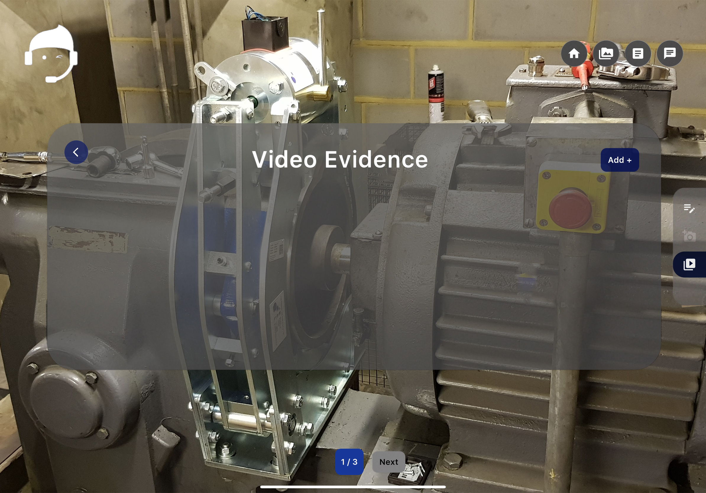<figcaption>
Go to the Video Icon to add Video Evidence
</figcaption></figure>

<figure>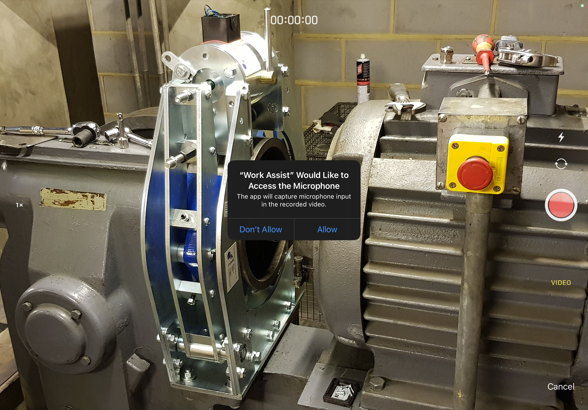<figcaption></figcaption></figure>

<figure>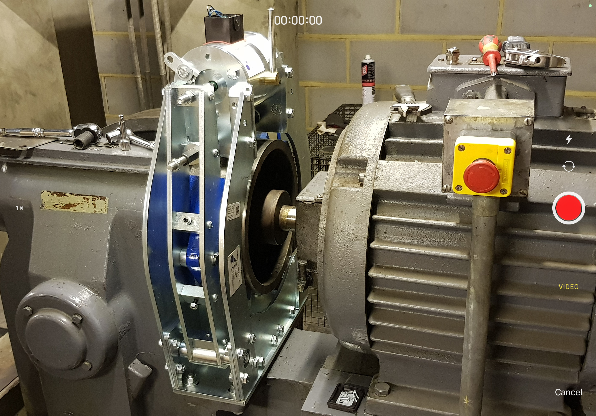<figcaption></figcaption></figure>

2. Record the video and click on use video after capturing / recording the video.

<figure>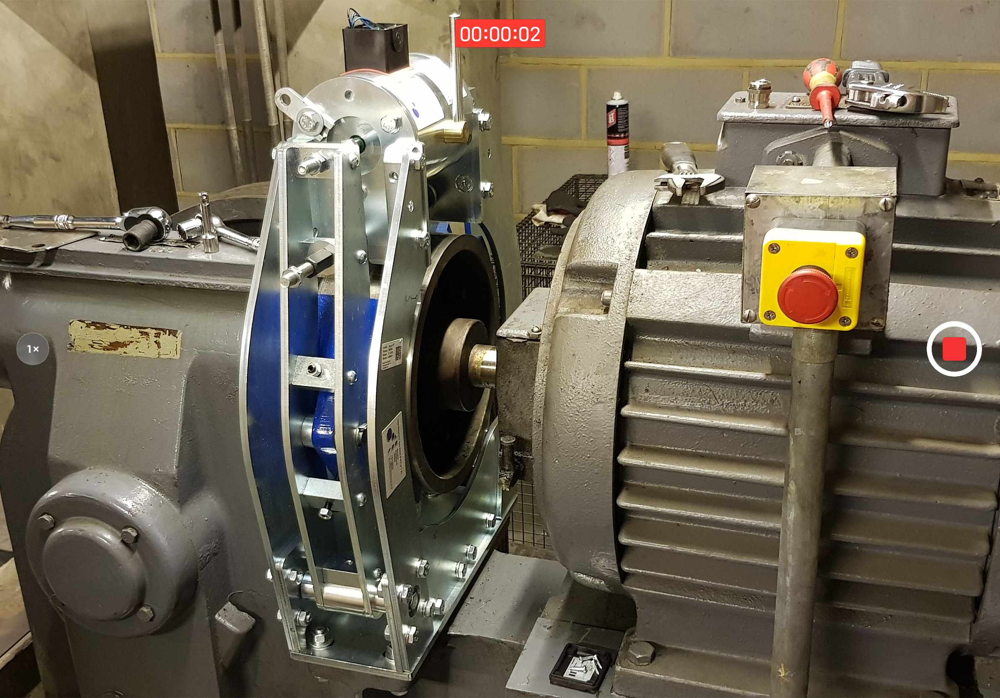<figcaption>
Record the video
</figcaption></figure>

<figure>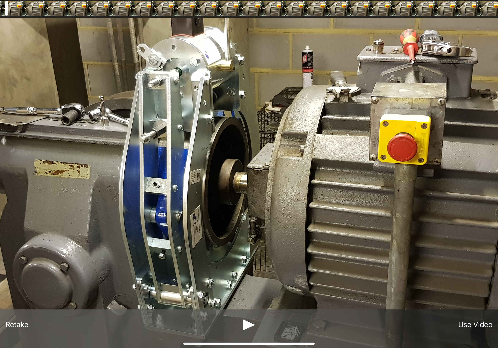<figcaption>
Go to use video to add the video evidence 
</figcaption></figure>

<figure>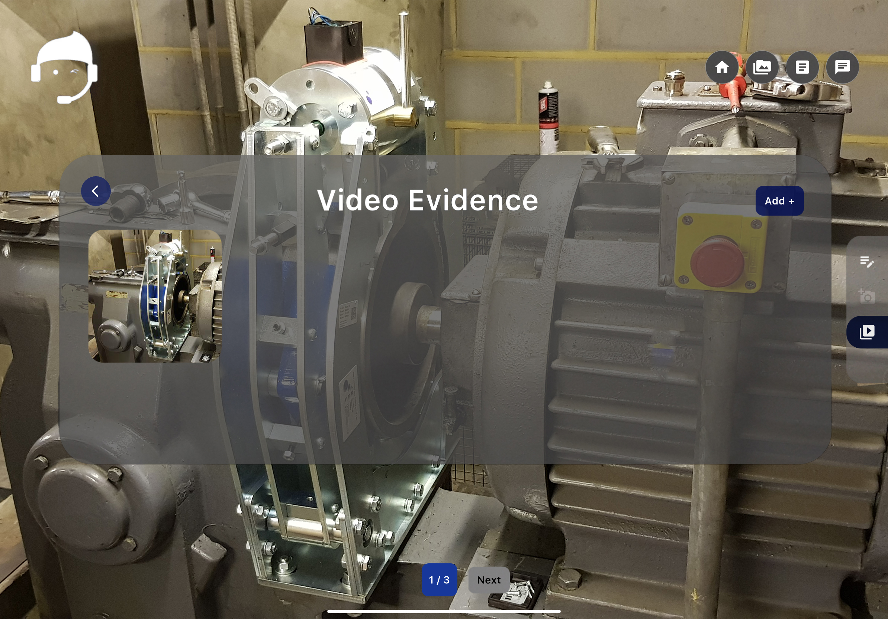<figcaption></figcaption></figure>

Now your Video Evidence is saved. Similarly you can add more videos.&#x20;

## ENDS

