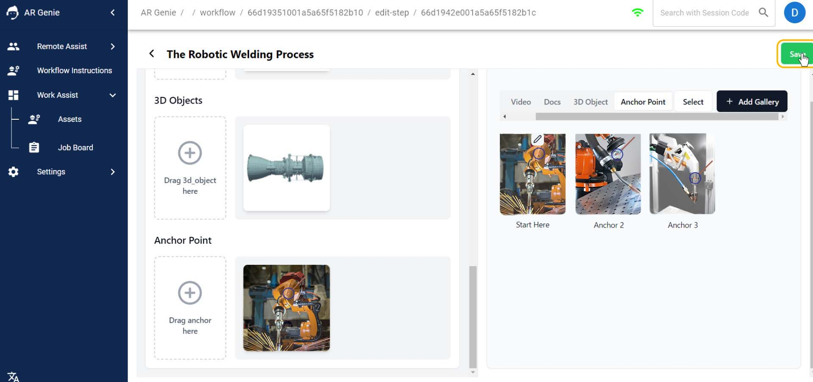

# ✍️ Create Workflows

## How to Create Workflows for an Asset ?

<figure><figcaption>
Create Workflow 
</figcaption></figure>

## Workflows:&#x20;

Workflows are the set of **step-by-step work instructions** to be performed by the respective personnel to complete a specific job or task. In the context of Augmented Reality (AR), these workflows are enhanced and visualized AR technology to guide workers through complex procedures via AR annotations, 3D models, or voice assisted commands for quick completion of their assigned jobs.&#x20;

### To create the workflow for an asset:

* Under Asset Type Selection, **Click on** **“Select Asset Type”**.

<figure><figcaption>
<strong>Click on Select Asset Type</strong> 
</figcaption></figure>

* Select the **" Asset Type"** &#x20;

<figure><figcaption>
<strong>Select Asset Type</strong> 
</figcaption></figure>

* Click on **“ Workflow”**.

<figure><figcaption>
<strong>Go to >> Workflow</strong>
</figcaption></figure>

The Workflow Dashboard will open on your screen.

\

<figure><figcaption>
<strong>Workflow Dashboard</strong> 
</figcaption></figure>

* Now, **Click on the** **"Add Button"**  to create the workflows.

<figure><figcaption>
<strong>Cl</strong>i<strong>ck on " Add Button"</strong>
</figcaption></figure>

* Add the **"Workflow Name"** and **Click on "Save".**

\

<figure><figcaption>
Add Workflow &#x26; Save 
</figcaption></figure>

\
The saved workflow name list will appear on your screen.

\

<figure><figcaption>
Workflow List 
</figcaption></figure>

* Now, **Click on the** **"number of steps"** on the workflow list to create step-by-step work instructions.&#x20;

\

<figure><figcaption>
Click on Number of Steps 
</figcaption></figure>

* Go to >> **“ Add Steps”**.

<figure><figcaption>
Add Steps 
</figcaption></figure>

Fill in the Step Name, Description and add Resources such as : Images, Videos, Documents, 3D Objects, or Anchor Point for the particular step.

<figure><figcaption>
<strong>Create Steps</strong>
</figcaption></figure>

You can also select the options for adding the evidence for the specific steps.

### How to Add Anchor Points:

Anchors can be added in the resource gallery in form of images. You can simply drag the uploaded anchors from the gallery and add it to the workflows for a particular step.

\

<figure><figcaption>
Anchors  
</figcaption></figure>

<figure><figcaption>
Drag Anchor to upload 
</figcaption></figure>

* After filling all the required details, **Click on** **" Save Button".**

<figure><figcaption>
Click on Save  
</figcaption></figure>

<figure><figcaption>
<strong>Workflow has been saved</strong> 
</figcaption></figure>

Now your steps had been successfully saved. Similarly you can add more steps for the workflows.

<figure><figcaption>
Add More Steps on Workflow 
</figcaption></figure>

### To view your saved Steps:

### &#x20;

* Click on the **" down arrow"** below View option.

<figure><figcaption>
Click on Down Arrow
</figcaption></figure>

<figure><figcaption>
<strong>Steps Overview</strong>  
</figcaption></figure>

To edit or delete the steps, Click on the respective icons as shown in the figure below:&#x20;

\

<figure><figcaption>
Edit or Delete Steps 
</figcaption></figure>

## ENDS&#x20;

