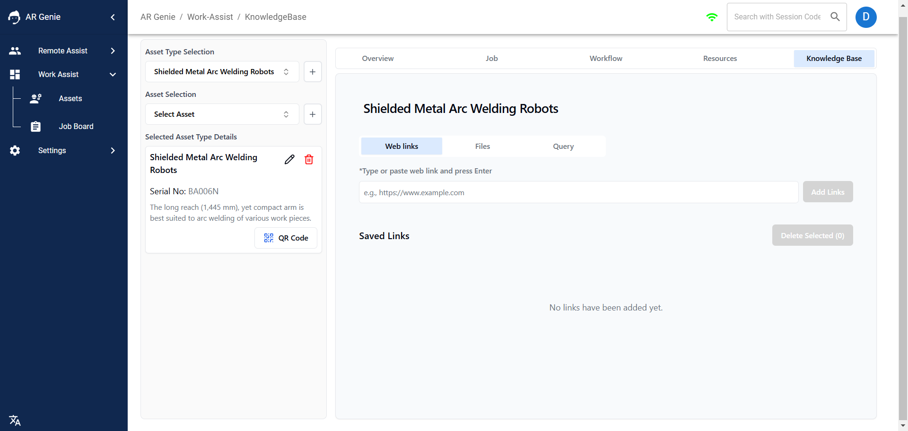
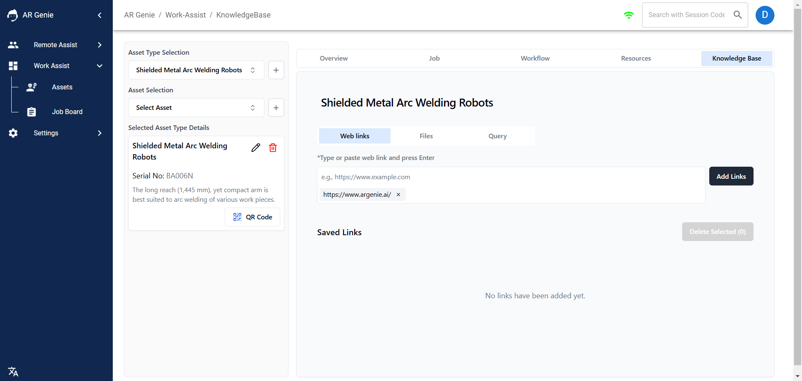
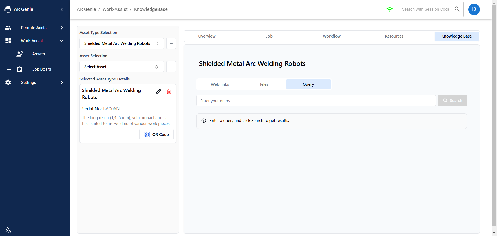

# 📚 Knowledge Base

## How to access or use Knowledge Base?

<figure><figcaption>
Knowledge Base
</figcaption></figure>

### Knowledge Base: 

The Knowledge Base consists of information within AR Genie Work Assist that serves as a centralized resource for users. It's designed to provide quick access to a wide range of helpful information and resources.

Here users can save or store the important links from the web or internet, upload files. By utilizing and contributing to the Knowledge Base, users can quickly find answers to their questions, access important resources, and share knowledge across the organization.

### To View or Access Knowledge Base:&#x20;

* Go to >> the **"Asset Dashboard "** & Select the **" Asset Type"**&#x20;

<figure><figcaption>
Select Asset Type 
</figcaption></figure>

* Now Click on **" Knowledge Base"**.&#x20;

<figure><figcaption>
Click on Knowledge Base 
</figcaption></figure>

### Create Knowledge Base:&#x20;

Once the knowledge base dashboard appear on your screen, you can easily add " Web Links" & Files.

<figure><figcaption>
Create Knowledge Base 
</figcaption></figure>

* Copy a Web Link or File and press **"Enter"** to upload, and then click on **" Add Links"** to save it.&#x20;

<figure><figcaption>
Add Web Link &#x26; Press Enter 
</figcaption></figure>

<figure><figcaption>
Click on Add Link to Save 
</figcaption></figure>

### To Ask Query:&#x20;

* Enter your Query. \

<figure><figcaption>
Enter Query 
</figcaption></figure>

* Click on Search Results&#x20;

<figure><figcaption>
Click on Search 
</figcaption></figure>

In this way you can create, access or use knowledge base to get your searched or query results.&#x20;

## ENDS&#x20;
