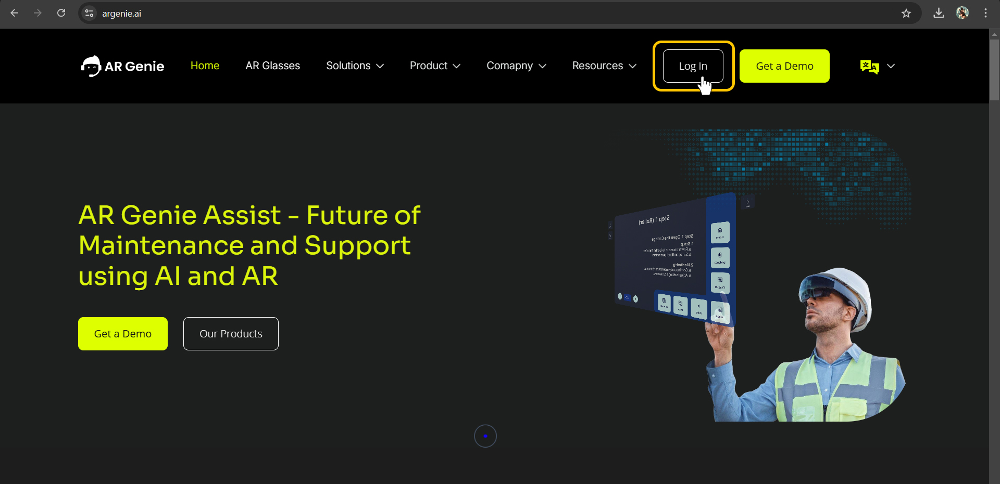

# 👩‍💻 Login

## How to begin with Work Assist on Web-based Portal

<figure><figcaption>
Work Assist Portal Login
</figcaption></figure>

## To begin using AR Genie Work Assist:

First you must need to contact and verify your details from AR Genie Support Center.&#x20;

* Go to >> the **"Contact Us"** Page on the website.&#x20;

\

<figure><figcaption>
Contact Us Web Page 
</figcaption></figure>

Fill in the required details and leave a message to access the AR Genie Web-based Portal for using the service.&#x20;

* Click on **" Send Message"** and you will receive a notification of the sent enquiry.&#x20;

Once verified, you will get the message on your Gmail account to use AR Genie Web-based portal. \

### How to Login on the Web Portal ?&#x20;

\
Once your details are verified, you can simply login from the website or simply visiting the link: [**https://portal.argenie.ai/login**](https://portal.argenie.ai/login)\
\
\
**To Login:**&#x20;

* On the Website Homepage, **Click on " Login"** button.&#x20;

\

<figure><figcaption>
<strong>Click on " Login"</strong>
</figcaption></figure>

The portal Login Homepage will appear on your window screen.

\

<figure><figcaption>
 Login Homepage 
</figcaption></figure>

* Fill in your account login details and **Click to " Login"**. You can also select the preferred language from the language icon.&#x20;

\

<figure><figcaption>
Click to Login 
</figcaption></figure>

Now you have access to the **AR Genie Portal (**[**https://portal.argenie.ai**](https://portal.argenie.ai/login)**)** from where you can create work instructions and manage your job workflows.&#x20;

## ENDS

