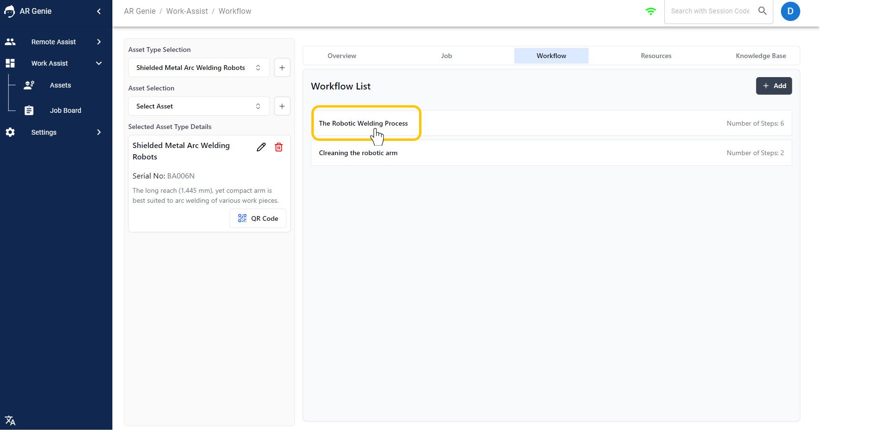
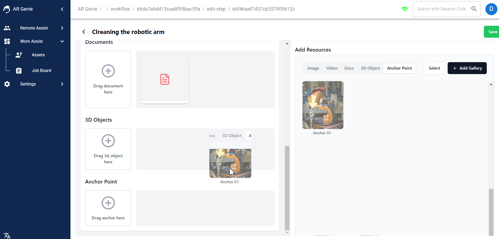

# 📹 Resource ( Gallery )

<figure><figcaption>
Resource Gallery 
</figcaption></figure>

### Resource (Gallery):

The **Resource ( Gallery )** in AR Genie Work Assist is a central hub where you can store and manage all the digital assets ( Images, 3D Objects, Videos, Documents, and Anchor Points ) that you will use to create work instructions and other augmented reality (AR) experiences. &#x20;

### Where to find Resources on AR Genie Work Assist Web Portal?&#x20;

**To view Resources:**&#x20;

* Go to >> the **" Assets"** dashboard.&#x20;

<figure><figcaption>
Asset Dashboard
</figcaption></figure>

* Select the **" Asset Type"** .

<figure><figcaption>
Select Asset Type 
</figcaption></figure>

* Now **Click on " Resources"** and you will see all the resources used in creating the workflows on AR Genie Work Assist for that particular asset type.

<figure><figcaption>
Click on Resources  
</figcaption></figure>

<figure><figcaption>
Resources used in the Asset Type " Shield Metal Arc Welding" 
</figcaption></figure>

Here you can view all the resources used to create the workflow of a particular asset type.

### How to add Media files?&#x20;

You can add media files for your workflows via Resources ( Gallery ) and while creating the work instructions.&#x20;

**Resources:** On resources you will find all the media files used to create that specific Asset Type. Here you can only add the media files for the asset type you have selected.&#x20;

* Go to >> the **" Resources"** on the Asset Type.

\

<figure><figcaption>
Go to Resources 
</figcaption></figure>

Add Gallery includes all the files used or stored in creating the workflows.

* &#x20;Click on **" Add Gallery"** and select the media file you want to add for that particular asset type. You can also upload new files from your system from the drag and drop option.

\

<figure><figcaption>
Click on Add Gallery
</figcaption></figure>

&#x20;

**Add Media Files while creating Work Instructions:**&#x20;

To add media files while creating workflows, simply drag and drop the files from the resource gallery or upload a new media from your system.\

### How to Add Anchor Points on Workflow steps?&#x20;

You can add Anchor Points for your workflows while creating the work instructions.&#x20;

* Go to >> the **" Workflow"** of the Asset Type, you want to add the Anchor Point.

* &#x20;Select the Workflow from the **" Workflow List"** .

\

<figure><figcaption>
Select the workflow from the list
</figcaption></figure>

Click on the **"Edit"** icon of the workflow steps, you want to add the Anchor point for.

\

<figure><figcaption>
Click on Edit 
</figcaption></figure>

* &#x20; Select the **"Anchor Point"** from the "**Add Resources"** and drag it to your " Anchor Point " workflow step.&#x20;

<figure><figcaption>
Drag the anchor point 
</figcaption></figure>

## ENDS

