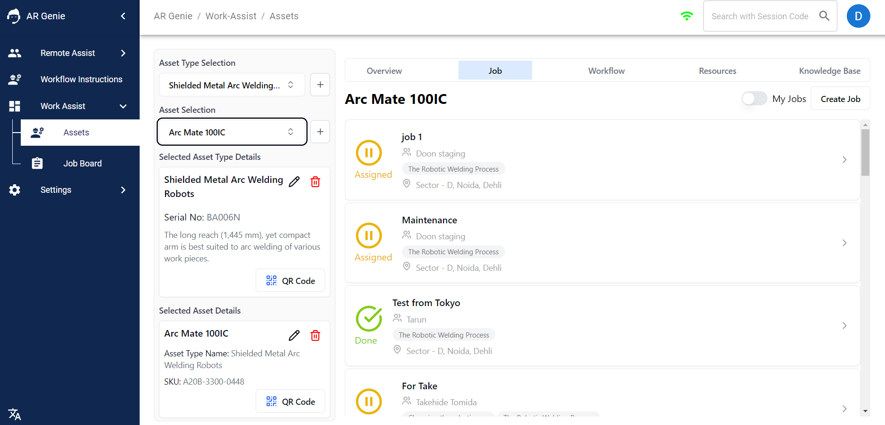
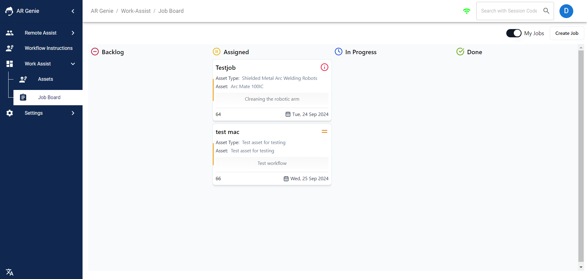
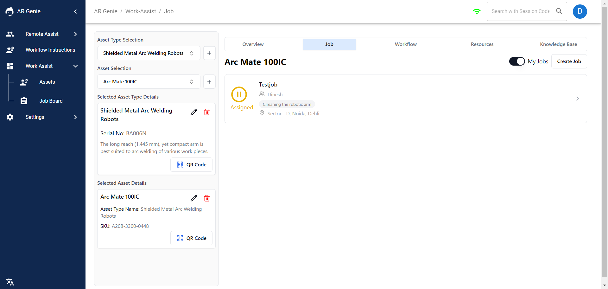

# 👓 View Assigned Jobs & My jobs

<figure><figcaption></figcaption></figure>

### Users can view the jobs from the Job Board & Assets.

### To View Your Saved or Assigned Jobs from:

### Assets:

* Go to **Asset Dashboard**.

<figure><figcaption>
Asset Board  
</figcaption></figure>

Select the **" Asset Type ''** for which you want to view the job details for.&#x20;

\

<figure><figcaption>
Select Asset Type 
</figcaption></figure>

* Now **Select the “ Asset”** under the Asset Selection.

\

<figure><figcaption>
Select the Asset 
</figcaption></figure>

* After selecting the Asset, **Click on the “ Job”**.

<figure><figcaption>
click on job 
</figcaption></figure>

\
This will show the overview list of all the assigned, completed and unfinished jobs.

\

<figure><figcaption>
List of all the jobs 
</figcaption></figure>

### To view your own job / My Jobs &#x20;

You can view your Jobs either from the Job Board or Asset Board.&#x20;

### To view Job from the Job Board:&#x20;

* Go to >> the Job Board and **" Enable My Job"** on the job dashboard.&#x20;

\

<figure><figcaption>
Enable My Job on Job Board
</figcaption></figure>

\
This will show you the complete details of your own job.&#x20;

\

<figure><figcaption>
My Jobs 
</figcaption></figure>

### To view Job from the Asset Board:&#x20;

* Go to >> the Asset Board and **Select the Asset Type & Asset**.&#x20;

* Now Go to >> the **Job and Enable " My Job "** to view your job details.&#x20;

\

<figure><figcaption>
Enable My Jobs 
</figcaption></figure>

\
This will show you your job details.&#x20;

\

<figure><figcaption>
My Jobs 
</figcaption></figure>

## ENDS

